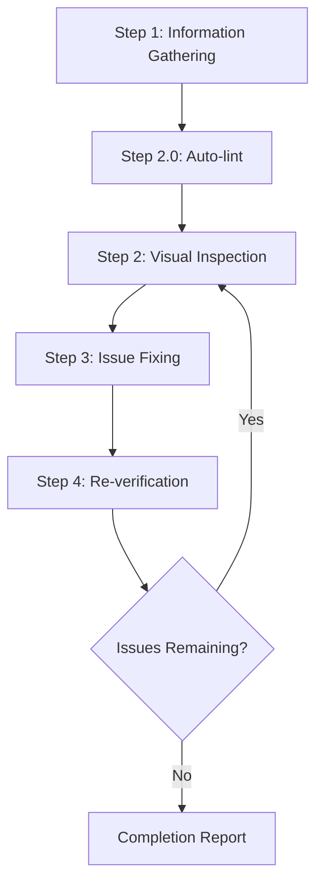
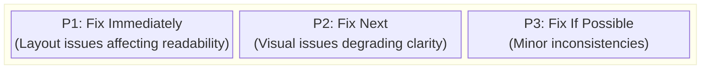
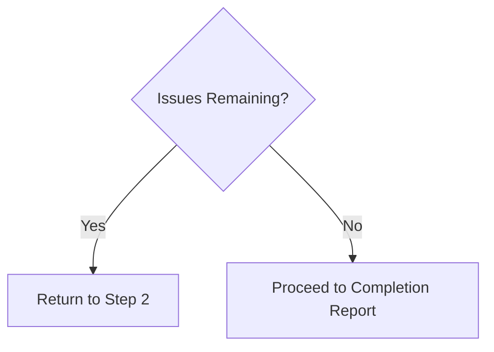

# PPTX Design Reviewer

This skill enables visual inspection and validation of PPTX slide deck design
quality, identifying and fixing issues at the source slide deck level.

## Scope of Application

- PPTX slide decks
- Google Slides or Keynote exports (when provided as PPTX or PDF)
- Any slide-based presentation intended for screen, projection, or print

## Prerequisites

### Required

1. **Target slide deck must be available**
   - Local file path to `.pptx`
   - Exported PDF (for read-only review)

2. **Slide viewing must be available**
   - PowerPoint / Google Slides / Keynote / LibreOffice
   - Or a reliable export to images (one image per slide)

3. **Access to source deck (when making fixes)**
   - The editable PPTX file must exist within the workspace

## Design Guidelines (Reference)

These documents define the visual and structural rules used when judging issues:

- [`doc/slide-guideline-v1.yml`](../../doc/slide-guideline-v1.yml) —
  Current guideline (v1.4, 16:9 / 1440×810pt, screen-only delivery)
- [`doc/slide-guideline-v0.yml`](../../doc/slide-guideline-v0.yml) —
  Earlier version, retained for traceability
- [`doc/design-system-review-v0.md`](../../doc/design-system-review-v0.md) —
  Backlog of design system items still under review

## Auto-lint (Step 2.0)

Before manual visual inspection, run the automated lint to catch mechanical
guideline violations. The lint mirrors `doc/slide-guideline-v1.yml`.

```bash
python3 scripts/pptx_lint.py path/to/DECK.pptx
python3 scripts/pptx_lint.py path/to/DECK.pptx --severity error
python3 scripts/pptx_lint.py path/to/DECK.pptx --json > lint.json
```

Exit code: `1` if any error, `0` otherwise. Checks (initial set):

| Check | Severity | Description |
| ------- | ---------- | ------------- |
| `overflow` | error | Element extends beyond 1440×810pt slide canvas |
| `safe_text_area` | warning | Text element outside safe text area (x:81, y:40, w:1278, h:690) |
| `text_autofit_disabled` | error | Text frame auto-size is not NONE |
| `font_family` | warning | Font family not in `Noto Sans JP` / `Calibri` (weight suffix tolerated) |
| `font_size_scale` | warning | Font size not in `{20, 24, 32, 36, 56, 80}` |
| `text_color_allowlist` | warning | Explicit text color is outside the allowed text palette |
| `background_color_palette` | warning | Explicit shape fill color is outside the allowed fill/background palette |
| `animation_present` | error | Slide contains `<p:transition>` or `<p:timing>` |
| `slide_size` | warning | Deck slide size differs from 1440×810pt |

Use lint output to scope manual inspection: triage errors first, then warnings,
then move on to visual checks (overlap, hierarchy, photo handling) that the lint
does not cover.

When the same template element trips the same check on many slides (typical of
footers/headers copied across the deck), findings are consolidated into one
deck-level entry that lists the affected slide range. Pass `--no-consolidate`
to see every per-slide occurrence.

### Regenerating fixtures and running the smoke test

`good.pptx` (compliant) and `bad.pptx` (intentionally violating) live in
`examples/` and are excluded by `.gitignore`. Generate them on demand:

```bash
python3 scripts/make_examples.py
python3 scripts/test_pptx_lint.py
```

The fixture script writes `examples/good.pptx` and `examples/bad.pptx`.
The test asserts 0 findings on good and all expected checks on bad.

Use the smoke test as a regression check after editing `pptx_lint.py`.

## Source repair (Step 1.5)

Before auto-fix, repair the source package when the PPTX contains orphan slide
parts: physical `ppt/slides/slideN.xml` files that are no longer reachable from
`ppt/_rels/presentation.xml.rels`. These orphan parts can make `python-pptx`
fail or leave changes non-durable because slide part names collide while
`prs.slides` is being loaded.

Run this when `pptx_fix.py` reports residual actions after its self-check, when
`zipfile` emits a `Duplicate name: ppt/slides/slideN.xml` warning, or when a
deck opens in PowerPoint but fails during automated lint/fix.

```bash
python3 scripts/pptx_repair.py path/to/DECK.pptx
python3 scripts/pptx_repair.py path/to/DECK.pptx --apply
python3 scripts/pptx_repair.py path/to/DECK.pptx --apply --backup
python3 scripts/pptx_repair.py path/to/DECK.pptx --json
```

The default mode is dry-run. `--apply` removes orphan slide parts in-place.
`--backup` writes `DECK.pptx.bak` if absent.

The repair keeps only slide XML parts reachable from `presentation.xml.rels` and
removes each orphan slide's matching `ppt/slides/_rels/slideN.xml.rels`. Other
ZIP entries such as media, themes, layouts, and masters are not touched.

Known limits:

- Extra `[Content_Types].xml` `<Override PartName=.../>` entries are left
  as-is. PowerPoint normally tolerates unused overrides.
- Notes parts such as `notesSlideN.xml` are out of scope.

## Auto-fix (Step 2.1)

After lint, run the auto-fixer to apply safe mechanical corrections. Only rules
where the right answer is unambiguous are in scope; everything else stays
manual.

```bash
python3 scripts/pptx_fix.py path/to/DECK.pptx
python3 scripts/pptx_fix.py path/to/DECK.pptx --apply
python3 scripts/pptx_fix.py path/to/DECK.pptx --apply --backup
python3 scripts/pptx_fix.py path/to/DECK.pptx --apply --rules autofit
python3 scripts/pptx_fix.py path/to/DECK.pptx --json
```

The default mode is dry-run. `--apply` writes in-place. `--backup` writes
`DECK.pptx.bak` if absent.

| Rule | Action |
| ------ | -------- |
| `autofit` | Set `text_frame.auto_size` to `MSO_AUTO_SIZE.NONE` when it differs |
| `geometry` | Round shape `left/top/width/height` to nearest 1pt for drift <0.1pt |

Out of fixer scope (require human judgment): `font_family`, `font_size_scale`,
`overflow`, `safe_text_area`, `animation_present`, `slide_size`. Re-lint after
applying to triage what remains.

After `--apply`, the fixer re-reads the saved file and verifies the change is
durable on disk. If any action is still detected, it prints a
`WARNING: self-check found N residual actions ...` line to stderr and exits
**2**. Causes seen so far:

- Corrupted source PPTX with duplicate zip entries (`UserWarning: Duplicate
  name: ppt/slides/slideN.xml` from `zipfile`). python-pptx writes both copies;
  only one ends up fixed. Repair the source deck first.
- Inherited `<a:bodyPr>` from layout/master that the slide-level setter cannot
  override. May require editing the layout XML directly.

Exit code: 0 = success, 1 = invocation error, 2 = applied but residual remained.

Regression test:

```bash
python3 scripts/test_pptx_fix.py
```

The test verifies `bad.pptx` autofit fixes and geometry rounding.

## Image-based Review (Before/After)

PPTX cannot be reliably rendered like a web page. When you need to ask
questions or confirm fixes visually, export slides to images and compare.

### Recommended Workflow

1. Export images for the target slide range (e.g., first 5 slides).
2. Ask questions using the exported images (Before/After).
3. Iterate: propose fixes, regenerate images, re-compare.

### Script (optional)

If LibreOffice is available (\`soffice\` in PATH), you can generate a
side-by-side HTML for Before/After:

\`\`\`bash
python3 scripts/make_review_images.py \
  --before BEFORE.pptx \
  --after AFTER.pptx \
  --outdir review-images \
  --slides 5
\`\`\`

Open \`review-images/index.html\` and use the PNGs to ask questions.

## Workflow Overview



---

## Step 1: Information Gathering Phase

### 1.1 File Confirmation

If the file path is not provided, ask the user:

> Please provide the path to the PPTX (or PDF for read-only review).

### 1.2 Understanding Deck Context

When making fixes, gather the following information:

| Item | Example Question |
| ------ | ------------------ |
| Authoring Tool | PowerPoint / Google Slides / Keynote? |
| Deck Purpose | Sales / Training / Report / Pitch? |
| Audience | Internal / External / Exec / Public? |
| Output Medium | On-screen / Projector / Print? |
| Review Scope | Specific slides or entire deck? |

### 1.3 Output & Delivery Constraints

Confirm constraints that affect layout decisions:

| Item | Example Question |
| ------ | ------------------ |
| Slide Size / Aspect | 16:9 or 4:3? Custom size? |
| Delivery Format | PPTX / PDF / both? |
| Playback Environment | PowerPoint / Slides / Keynote version? |
| Media Policy | Embedded only or links allowed? |

### 1.3 Automatic Deck Detection

Attempt basic detection from files in the workspace:

```text
Detection targets:
├── *.pptx        → Slide deck
├── *.pdf         → Exported deck (read-only)
└── assets/       → Linked images or charts (if any)
```

---

## Step 2: Visual Inspection Phase

### 2.1 Slide Traversal

1. Open the slide deck or exported PDF
2. Capture slide images (or view slide-by-slide)
3. If multiple sections exist, traverse in order

### 2.2 Inspection Items

#### Layout Issues

| Issue | Description | Severity |
| ------- | ------------- | ---------- |
| Element Overlap | Unintended overlap of text/images | High |
| Text-on-Text Overlap | Characters overlap due to layered text boxes or tight line spacing | High |
| Misalignment | Grid or baseline misalignment | Medium |
| Inconsistent Spacing | Padding/margin inconsistencies | Medium |
| Text Clipping | Text box cuts off content | Medium |

#### Typography Issues

| Issue | Description | Severity |
| ------- | ------------- | ---------- |
| Font Inconsistency | Mixed fonts or weights | Medium |
| Hierarchy Issues | Heading/body size hierarchy unclear | Medium |
| Line Spacing | Too tight or too loose | Medium |

#### Visual Consistency

| Issue | Description | Severity |
| ------- | ------------- | ---------- |
| Color Inconsistency | Non-unified palette usage | Medium |
| Icon Style Mismatch | Mixed icon families or stroke widths | Medium |
| Component Drift | Repeated elements not matching | Low |

#### Media Handling

| Issue | Description | Severity |
| ------- | ------------- | ---------- |
| Image Distortion | Aspect ratio stretched | High |
| Low Resolution | Blurry images on display | Medium |
| Cropping Errors | Important content cut off | Medium |
| Media Playback Risk | Embedded video may not play in target tool | Medium |

---

## Step 3: Issue Fixing Phase

### 3.1 Issue Prioritization



### 3.2 Identifying Source Slides

Identify the slide and element precisely:

1. **Slide number-based**
   - Record slide number and title

2. **Element-based**
   - Identify the specific text box, image, chart, or shape

### 3.3 Applying Fixes

#### Fix Principles

1. **Minimal Changes**: Only adjust what is necessary
2. **Respect Existing Patterns**: Follow the deck's visual system
3. **Avoid Breaking Slides**: Confirm changes do not introduce new issues
4. **Add Notes**: Document what was changed and why

---

## Step 4: Re-verification Phase

### 4.1 Post-fix Confirmation

1. Re-open the updated deck
2. Re-export slide images if needed
3. Compare before and after

### 4.2 Regression Testing

- Verify that fixes haven't affected other slides
- Confirm layout remains consistent across related slides

### 4.3 Iteration Decision



**Iteration Limit**: If more than 3 fix attempts are needed for a specific
issue, consult the user

---

## Output Format

### Review Results Report

```markdown
# PPTX Design Review Results

## Summary

| Item | Value |
| ------ | ------- |
| Deck File | {File path} |
| Authoring Tool | {PowerPoint / Slides / Keynote} |
| Slide Size / Aspect | {16:9 / 4:3 / Custom} |
| Delivery Format | {PPTX / PDF / Both} |
| Review Scope | {Slides or full deck} |
| Issues Detected | {N} |
| Issues Fixed | {M} |

## Detected Issues

### [P1] {Issue Title}

- **Slide**: {Slide number and title}
- **Element**: {Text box / Image / Chart / Shape}
- **Issue**: {Detailed description}
- **Fix Details**: {Description of changes}
- **Screenshot**: Before/After (if available)

### [P2] {Issue Title}
...

## Unfixed Issues (if any)

### {Issue Title}
- **Reason**: {Why it was not fixed/could not be fixed}
- **Recommended Action**: {Recommendations for user}

## Recommendations

- {Suggestions for future improvements}
```

---

## Required Capabilities

| Capability | Description | Required |
| ------------ | ------------- | ---------- |
| Slide Navigation | Open and move across slides | ✅ |
| Screenshot/Export | Capture slide images | ✅ |
| Image Analysis | Visual issue detection | ✅ |
| File Read/Write | Read/write PPTX files | Required for fixes |
| Output Validation | Verify PPTX/PDF rendering and media | Recommended |

---

## Best Practices

### DO (Recommended)

- ✅ Save a copy before making edits
- ✅ Fix one issue at a time and verify each
- ✅ Keep slide masters and layouts consistent
- ✅ Confirm with user before major changes
- ✅ Document fix details clearly

### DON'T (Not Recommended)

- ❌ Large-scale redesign without confirmation
- ❌ Ignoring existing brand guidelines
- ❌ Fixes that reduce readability
- ❌ Fixing multiple issues at once (difficult to verify)

---

## Troubleshooting

### Problem: Elements shift after editing

1. Check alignment and distribution settings
2. Verify slide master alignment
3. Confirm object anchoring or grouping
4. Re-open in the original authoring tool

### Problem: Images look blurry

1. Replace with higher-resolution assets
2. Avoid scaling up low-res images
3. Check export settings if using PDF

### Problem: Embedded media not playing

1. Verify codec and playback support in the target tool
2. Replace with static frames if playback is unreliable
3. Test on the delivery machine

### Problem: Fonts not rendering as expected

1. Confirm font availability on the target machine
2. Substitute with a close system font
3. Embed fonts if the tool allows
